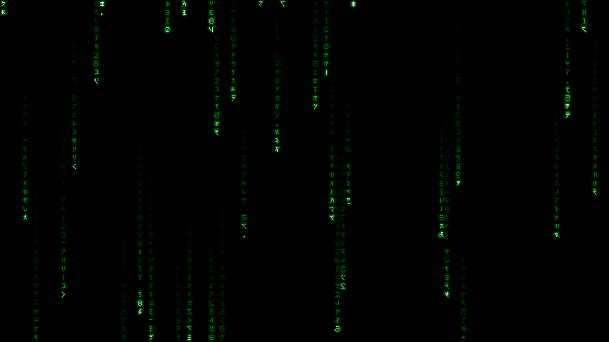

# MatrixCode for XScreenSaver

MatrixCode is a standalone OpenGL/GLX XScreenSaver hack designed to reproduce
the **flat, sparse, irregular digital code rain** associated with the original
*Matrix* films while remaining light enough for old or low-power X11 systems.



This repository builds one Debian/Ubuntu binary package:

- `xscreensaver-screensaver-matrixcode`

It installs beside XScreenSaver rather than modifying the upstream
`xscreensaver` package.

## What makes this implementation different

- The glyph grid is stationary; illumination waves travel down it.
- Each active column has one or occasionally two independently paced pulses.
- Trails vary in length, brightness, spacing, and speed.
- Heads approach pale green-white instead of uniform neon green.
- Glyphs mutate selectively as a head passes, with quieter background cycling.
- A custom 8x12 atlas combines original katakana-inspired forms, mirrored
  variants, digits, and punctuation.
- Glow is a lightweight additive texture pass, not a 3D scene or shader stack.
- The renderer has no per-frame heap allocation and defaults to 30 FPS.

The glyph artwork is a **clean-room visual interpretation**. It does not copy
Warner Bros. film frames, the official Matrix font, official Flash assets, or
third-party glyph textures.

## Build

On Debian or Ubuntu:

```sh
sudo apt install build-essential pkgconf libx11-dev libgl-dev \
  xvfb xauth libgl1-mesa-dri python3
make
make check
```

Run a preview:

```sh
./matrixcode -window
```

Render a deterministic test frame:

```sh
LIBGL_ALWAYS_SOFTWARE=1 xvfb-run -a \
  ./matrixcode -window -geometry 1280x720 -frames 70 \
  -seed 19990331 -no-vsync -screenshot preview.ppm
```

## Install from source

```sh
sudo make install PREFIX=/usr
```

Installed files:

```text
/usr/libexec/xscreensaver/matrixcode
/usr/share/xscreensaver/config/matrixcode.xml
/usr/share/applications/screensavers/matrixcode.desktop
/usr/share/man/man6/matrixcode.6x
```

Restart `xscreensaver-settings` after installation. MatrixCode should appear in
the list of screen savers. It can also be tested directly:

```sh
/usr/libexec/xscreensaver/matrixcode -root
```

## Debian/Ubuntu package

```sh
sudo apt build-dep .
dpkg-buildpackage -us -uc -b
sudo apt install ../xscreensaver-screensaver-matrixcode_*.deb
```

The source package is `xscreensaver-matrixcode`; the installable binary package
is `xscreensaver-screensaver-matrixcode`.

## Useful tuning

The defaults intentionally avoid the common overly dense, overly fast look.
For older hardware:

```sh
./matrixcode -window -fps 20 -cell-size 22 -density 34 -glow 48
```

For a denser display:

```sh
./matrixcode -window -density 55 -trail 22 -cell-size 16
```

See `matrixcode(6x)` or `./matrixcode -help` for every option.

## Compatibility

The normal build uses the system OpenGL and GLX development headers. A tiny
`compat/minigl.h` declaration set exists solely so source-level CI or recovery
environments with runtime GL libraries but no development headers can still
exercise this OpenGL 1.x code. Debian/Ubuntu packages always build against
`libgl-dev`.

## Documentation

- [Design and fidelity](docs/DESIGN.md)
- [Research notes](docs/RESEARCH.md)
- [Performance architecture](docs/PERFORMANCE.md)
- [Validation](docs/VALIDATION.md)
- [Build report](docs/BUILD-REPORT.md)
- [Contributing](CONTRIBUTING.md)

## License

MIT/X11. See [LICENSE](LICENSE).

`Matrix`, the Matrix code, and related marks are properties of their respective
owners. This project is unofficial and unaffiliated.
