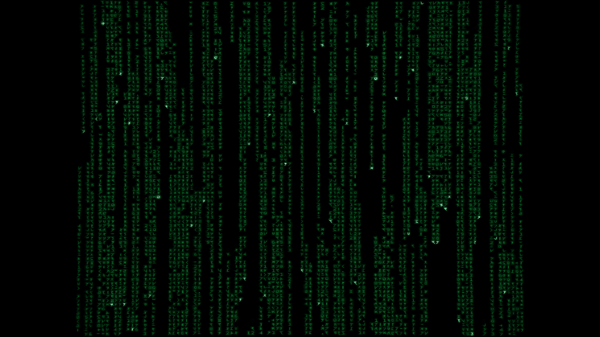

# MatrixCode for XScreenSaver — 1999 film-fidelity rework

MatrixCode is a standalone C/OpenGL/GLX XScreenSaver hack aimed at the visual
language of the original *Matrix* era.  Version `0.2.0-film-rework` is a major
fidelity pass over the initial renderer, with the first film's **operator CRT
screen** as the default target rather than a generic modern "digital rain"
effect.



The installable Debian/Ubuntu package is:

- `xscreensaver-screensaver-matrixcode`

It installs beside XScreenSaver and does not modify the upstream `xscreensaver`
package.

## Why the old version did not quite look like the movie

The old renderer had several individually reasonable choices that combined to
make it feel unlike a photographed 1999 workstation display:

- glyph size was derived directly from modern display pixels, so a 1080p/1440p
  desktop changed the apparent typography dramatically;
- glyph quads were too wide and read more like ordinary terminal characters;
- the default 42% active-column model produced too much empty horizontal space;
- trails used a smooth brightness gradient, while the first-film/operator look
  is flatter and more uniformly luminous behind a very bright cursor;
- the whole widescreen desktop was filled, whereas the prop displays read as
  old 4:3 CRT imagery;
- there was no raster/scanline/phosphor/tube treatment, so the image stayed
  unnaturally clean on a modern LCD/OLED panel.

The rework addresses those points as a system rather than by merely changing a
font-size constant.

## Profiles

### `operator1999` (default)

Designed for the green code seen on the operators' CRT displays in the first
film:

- 108 logical columns;
- square logical cell grid with tall/narrow ~1.35:1 glyph quads;
- 4:3 content aperture centered inside any modern display;
- flat luminous rain bodies with pale green-white cursors;
- irregular per-column timing and speed;
- slow independent glyph cycling;
- two-scale optical glow;
- 640x480 virtual CRT raster;
- subtle tube curvature, scanlines, phosphor grille, edge vignette and phosphor
  persistence.

Run it directly:

```sh
./matrixcode -window -profile operator1999
```

For a deterministic 1080p reference frame:

```sh
LIBGL_ALWAYS_SOFTWARE=1 xvfb-run -a \
  ./matrixcode -window -geometry 1920x1080 -frames 90 \
  -seed 19990331 -no-vsync -screenshot frame.ppm
```

### `opening1999`

A cleaner cinematic presentation without the CRT treatment:

```sh
./matrixcode -window -profile opening1999
```

### `clean`

A neutral modern rendering useful for comparing the rain simulation without the
film/CRT treatment:

```sh
./matrixcode -window -profile clean
```

## Build

On Debian or Ubuntu:

```sh
sudo apt install build-essential pkgconf libx11-dev libgl-dev \
  xvfb xauth libgl1-mesa-dri python3
make
make check
```

The normal build uses the system OpenGL headers.  A small compatibility header
exists only for recovery/CI environments that have `libGL.so.1` but not the
OpenGL development headers.

## Install from source

```sh
sudo make install PREFIX=/usr
```

Installed files:

```text
/usr/libexec/xscreensaver/matrixcode
/usr/share/xscreensaver/config/matrixcode.xml
/usr/share/applications/screensavers/matrixcode.desktop
/usr/share/man/man6/matrixcode.6x
```

Restart `xscreensaver-settings` after installation.  Direct full-screen testing:

```sh
/usr/libexec/xscreensaver/matrixcode -root
```

## Most useful tuning controls

Start by changing **geometry**, not color:

```text
-columns       logical code columns (default 108)
-aspect        auto, 4:3, 16:9, or 2.39:1
-density       visible portion of the rain cycle
-speed         fall speed
-trail         rain period / illuminated run length
-cycle         independent symbol cycling
```

Then tune the photographic treatment:

```text
-glow
-crt / -no-crt
-curvature
-scanlines
-phosphor-mask
-vignette
-persistence
-overscan
```

See `docs/TUNING.md` and `matrixcode(6x)` for details.

## Clean-room boundary

This repository deliberately does **not** ship the official Matrix glyph font,
film-frame extractions, promotional SWF assets, or glyph textures copied from
other recreations.  The 57 base 8x12 glyphs are the project's original
clean-room artwork; mirrored variants provide 114 addressable glyphs.

Public research into the motion, spacing and compositing behavior informed the
renderer, but the artwork remains independent.  That preserves a useful legal
and technical boundary while allowing the simulation to converge much more
closely on the film's visual grammar.

## Documentation

- [Fidelity research](docs/FIDELITY-RESEARCH.md)
- [Design](docs/DESIGN.md)
- [Performance](docs/PERFORMANCE.md)
- [Tuning and display calibration](docs/TUNING.md)
- [Validation](docs/VALIDATION.md)

## License

MIT/X11.  See [LICENSE](LICENSE).

`Matrix`, its code imagery, and related marks are properties of their respective
owners.  This project is unofficial and unaffiliated.
